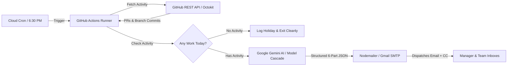

# Automated Daily Status Report Bot

> Autonomous AI-powered assistant that tracks your daily GitHub pull requests and commits, summarizes them into a formal 6-part technical status report using Google Gemini, and dispatches the email to your managers and team on schedule.

[](https://www.typescriptlang.org/)
[](https://nodejs.org/)
[](https://aistudio.google.com/)
[](https://github.com/features/actions)
[](LICENSE)

---

## Problem This Project Solves

At the end of every work day, software engineers, interns, and contractors spend 15 to 30 minutes manually:
1. Searching through git logs, branch commits, and pull requests to remember what they accomplished.
2. Manually writing and formatting status emails to match company reporting guidelines.
3. Remembering PR links, commit hashes, blockers, and next steps.
4. Sending emails on time, or accidentally sending empty reports on holidays and sick days.

### The Solution
This bot automates the entire lifecycle:
* **Zero Manual Effort**: Automatically inspects your assigned repositories, forks, and pull requests.
* **Deep Commit Extraction**: Discovers commits inside active and open PR branches, not just the merged base branch.
* **Intelligent Synthesis**: Gemini AI digests technical diffs and outputs a formal, executive-ready 6-section report.
* **Smart Holiday Detection**: If you made 0 commits and 0 PRs (holidays, weekends, sick leave), the bot gracefully skips execution without sending empty emails.
* **Self-Healing Architecture**: Built-in multi-model fallback cascade (`gemini-3.6-flash` -> `gemini-3.7-flash` -> `gemini-3.5-flash`), 120s timeout, and IPv4 DNS routing ensure 99.9% delivery reliability even during Google API traffic spikes.
* **100% Configurable**: No hardcoded names or company details. Everything is driven by environment variables.

---

## Architecture and Tech Stack



### Core Technologies and Their Roles

| Component | Technology | Role |
| :--- | :--- | :--- |
| **Language & Engine** | [TypeScript](https://www.typescriptlang.org/) & [Node.js 22 LTS](https://nodejs.org/) | Strict type safety, clean asynchronous pipeline, and native `undici` fetch engine. |
| **GitHub Integration** | [@octokit/rest](https://github.com/octokit/rest.js/) | Queries PRs, reviews, and granular branch commit messages across private/public repos and forks. |
| **AI Intelligence** | [@google/generative-ai](https://www.npmjs.com/package/@google/generative-ai) | Evaluates developer work logs and generates formal reports using JSON structured outputs. |
| **Email Delivery** | [Nodemailer](https://nodemailer.com/) | Dispatches formatted plain-text status updates with custom display names, primary recipients, and CC lists. |
| **Automation** | [GitHub Actions](https://github.com/features/actions) & [cron-job.org](https://cron-job.org/) | Serverless CI/CD execution triggered daily at business closing time. |

---

## The 6-Part Daily Status Report Schema

The AI generates a formal report structured into the exact 6-part schema required by enterprise development teams:

```text
Subject: Daily Status Report - DD-MM-YYYY - [Developer Name] ([Brief Technical Highlight])

1) TODAY'S TASKS ASSIGNED
- Assigned By: [Manager / Lead Name]
- Deadline: DD-MM-YYYY
- Task: [Extracted task objectives]

2) WORK COMPLETED TODAY (WITH PROOF)
- [Granular technical accomplishments extracted from PR commits]
- Time Taken: [Work Hours, e.g. 8 Hours]
- Proof: [Link to Pull Request]

3) PENDING WORK (WITH REASON + NEXT ACTION)
- [Review statuses, pending merges, or incomplete phases with next steps]

4) BLOCKERS / SUPPORT REQUIRED (IF ANY)
- [Technical blockers or None]

5) DAILY OUTPUT SUMMARY
- [High-level executive summary of the value delivered today]

6) NEXT WORK PLAN
- [Action items planned for tomorrow]

Regards,
[Developer Name]
[Job Title]
[Company Name]
```

---

## Step-by-Step API Key & Credential Guide

To get this bot running quickly, follow these direct step-by-step setup guides for each required credential:

### 1. How to Generate GitHub Personal Access Token (`GH_PAT`)

The bot uses this token to inspect pull requests, branch commits, and repository activity across your company repositories and personal forks.

1. Open [GitHub Personal Access Tokens (Classic)](https://github.com/settings/tokens).
2. Click **Generate new token** -> **Generate new token (classic)**.
3. In the **Note** field, enter: `daily-report-bot`.
4. Choose an expiration period (e.g. `90 days` or `No expiration` for dedicated automation).
5. Select the required permission scopes:
   * **`repo`** (Full control of private repositories - required to read PRs and commits from private repos).
   * **`read:org`** (Read organization data - required if your repository is owned by an organization).
6. Scroll to the bottom and click **Generate token**.
7. **Copy your token immediately** (`ghp_...`) and save it securely.
8. *(Important for Organization SSO)*: If your company organization enforces SAML/SSO, click **Configure SSO** next to your newly generated token and click **Authorize** for your organization.

---

### 2. How to Generate Google Gemini API Key (`GEMINI_API_KEY`)

The bot uses the Google Gemini API to analyze raw developer commits and draft formal structured status reports.

1. Open [Google AI Studio API Keys](https://aistudio.google.com/app/apikey).
2. Sign in with your Google account.
3. Click **Create API Key**.
4. Select an existing Google Cloud project or choose **Create API key in new project**.
5. **Copy the generated API key** (`AIzaSy...`).
6. *(Note)*: Google's free tier provides generous limits, allowing multiple daily report runs at zero cost.

---

### 3. Note on `GEMINI_MODEL` (Optional - Built-in Multi-Model Fallback)

**You can keep `GEMINI_MODEL` unset!** 

You do **not** need to configure this variable. Inside `src/generator.ts`, the bot has a built-in, self-healing multi-model fallback cascade using three active Gemini 3 family models:
1. **Primary**: `gemini-3.6-flash`
2. **Secondary**: `gemini-3.7-flash` (used if primary experiences a 503 capacity spike or timeout)
3. **Tertiary**: `gemini-3.5-flash` (used if secondary experiences temporary high load)

Only provide `GEMINI_MODEL` if you explicitly wish to override this default cascade with a custom model.

---

### 4. How to Generate Gmail App Password (`GMAIL_APP_PASSWORD`)

The bot uses Gmail SMTP via Nodemailer to deliver the final report to your manager, leads, and team.

1. Ensure **2-Step Verification** is turned on for your Google Account:
   * Visit [Google Account Security](https://myaccount.google.com/security) -> Turn on **2-Step Verification**.
2. Open [Google App Passwords](https://myaccount.google.com/apppasswords).
3. In the app name box, enter: `Daily Report Bot`.
4. Click **Create**.
5. Google will display a **16-character passcode** (e.g. `abcd efgh ijkl mnop`).
6. **Copy this 16-character code** (spaces can be omitted: `abcdefghijklmnop`).

---

## Environment Variables Reference

Configure these in your local `.env` file or as **GitHub Secrets** under **Settings -> Secrets and variables -> Actions**:

| Variable Name | Required | Description | Example |
| :--- | :---: | :--- | :--- |
| `GH_PAT` | **Yes** | GitHub Personal Access Token with `repo` scope | `ghp_xxxxxxxxxxxx` |
| `GH_USERNAME` | **Yes** | Your GitHub username (matches author of commits/PRs) | `ashwanisingh011` |
| `TARGET_REPOS` | **Yes** | Target repositories (supports company repo + fork) | `TierceIndia/OCTYRAA,ashwanisingh011/OCTYRAA` |
| `GEMINI_API_KEY` | **Yes** | Google Gemini API Key from Google AI Studio | `AIzaSyxxxxxxxxxx` |
| `GEMINI_MODEL` | **Optional** | Leave empty to use default 3-model fallback (`3.6` -> `3.7` -> `3.5`) | `gemini-3.6-flash` |
| `SENDER_EMAIL` | **Yes** | Gmail address used to dispatch emails | `developer@tierceindia.com` |
| `GMAIL_APP_PASSWORD` | **Yes** | 16-character Google App Password | `abcdefghijklmnop` |
| `RECIPIENTS` | **Yes** | Primary recipient email addresses separated by commas | `lead@company.com,manager@company.com` |
| `CC_RECIPIENTS` | **Optional** | CC email addresses separated by commas | `colleague@company.com` |
| `DEVELOPER_NAME` | **Yes** | Your full name for reports & email headers | `Ashwani Singh` |
| `JOB_TITLE` | **Yes** | Your official job designation | `Full Stack Developer Intern` |
| `COMPANY_NAME` | **Yes** | Your organization or company name | `Tierce India Pvt Ltd` |
| `ASSIGNED_BY` | **Yes** | Your manager, supervisor, or mentor's name | `Vaishali Patel` |
| `WORK_HOURS` | **Yes** | Daily work hours reported in completed work section | `8 Hours` |

---

## Local Quickstart

### 1. Clone and Install
```bash
git clone https://github.com/ashwanisingh011/Email-Bot.git
cd Email-Bot
npm install
```

### 2. Configure Environment
```bash
cp .env.example .env
# Open .env and fill in your values
```

### 3. Build and Run
```bash
# Compile TypeScript
npm run build

# Run in production mode
npm run prod
```

---

## Running the Workflow: Manual vs. Automated

Once your GitHub Secrets are added, you can execute the bot in two ways: **manually on-demand with one click** (zero extra setup), or **automatically on a daily schedule**.

### 1. Add GitHub Repository Secrets (Required for Both)

In your GitHub repository:
1. Navigate to **Settings -> Secrets and variables -> Actions**.
2. Click **New repository secret** for each variable listed in the [Environment Variables Reference](#environment-variables-reference).

---

### Option A: Manual Trigger via GitHub Actions (Zero Extra Setup)

If you do not want to configure an external cron service or prefer to generate and send your report on demand whenever your workday wraps up:

1. Go to your repository on GitHub and open the **Actions** tab.
2. In the left sidebar, click **Automated Daily Status Report**.
3. Click the **Run workflow** dropdown button on the right side.
4. Leave the branch set to **`main`** and click the green **Run workflow** button.
5. The bot executes immediately, inspects today's activity, generates the AI report, and delivers the email within 25–30 seconds.

---

### Option B: Automated Cloud Scheduling via cron-job.org

If you want the report to run completely autonomously at **6:30 PM IST sharp** every weekday without touching anything:

GitHub Actions' internal cron queue often delays free-tier jobs during peak hours. Using a free webhook cron triggers `workflow_dispatch` within **2 seconds**:

1. Create a free account at [cron-job.org](https://cron-job.org).
2. Click **Create Cronjob**:
   * **Title**: `Daily Report Bot`
   * **URL**: `https://api.github.com/repos/YOUR_GITHUB_USERNAME/YOUR_REPO/actions/workflows/daily-report.yml/dispatches`
   * **Schedule**: Select **Every day at 18:30** (6:30 PM).
   * **Timezone**: `Asia/Kolkata (IST)`
   * **Days**: Check **Monday through Friday**.
3. Under **Advanced Settings**:
   * **Request Method**: `POST`
   * **Request Body**: `{"ref": "main"}`
   * **Headers**:
     * `Authorization`: `Bearer YOUR_GH_PAT`
     * `Accept`: `application/vnd.github.v3+json`
     * `User-Agent`: `Email-Bot`
4. Click **Create**.

---

## Reliability & Fault-Tolerance Features

* **IPv4 DNS Priority Enforcement**: GitHub Actions `ubuntu-latest` runners drop outbound IPv6 packets to Google APIs. The bot automatically invokes `dns.setDefaultResultOrder('ipv4first')` to ensure zero connection hangs.
* **120-Second Generation Window**: Provides ample time for deep structured JSON generation during peak datacenter hours.
* **Self-Healing AI Model Cascade**:
  ```text
  gemini-3.6-flash (Primary)
         | [On 503 Capacity / Timeout]
  gemini-3.7-flash (Secondary)
         | [On 503 Capacity / Timeout]
  gemini-3.5-flash (Tertiary)
  ```
* **Smart Holiday Skip**: Checks activity before calling external APIs. If 0 commits and 0 PRs are detected, it terminates cleanly with exit code 0 to avoid sending blank reports.

---

## Contributing & Customization

Contributions, suggestions, and feature requests are welcome:
1. Fork the Project.
2. Create your Feature Branch (`git checkout -b feature/AmazingFeature`).
3. Commit your Changes (`git commit -m 'feat: add AmazingFeature'`).
4. Push to the Branch (`git push origin feature/AmazingFeature`).
5. Open a Pull Request.

---

## License

Distributed under the **MIT License**. See [`LICENSE`](LICENSE) for more information.
